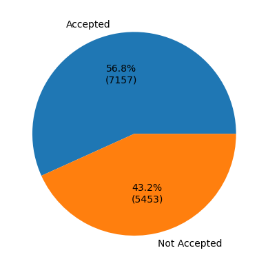
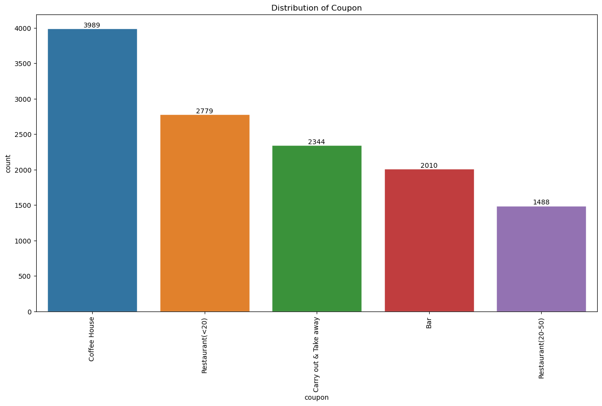
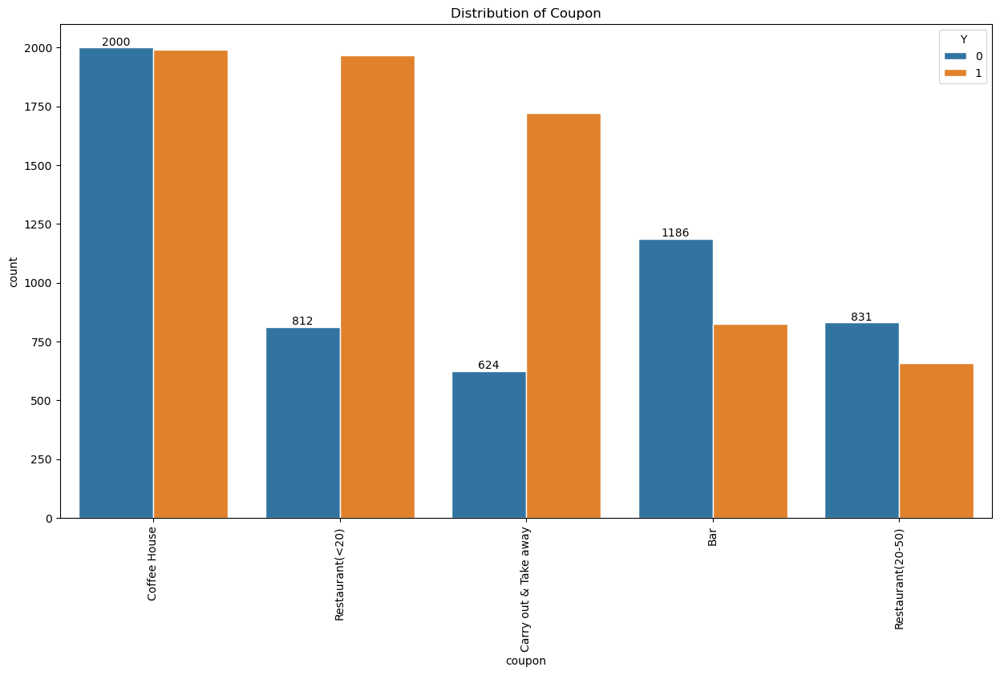
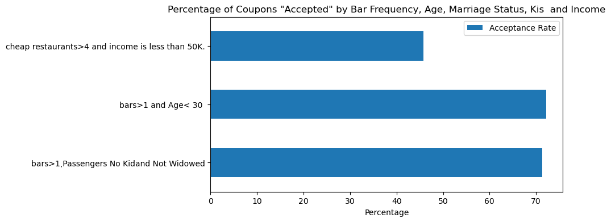
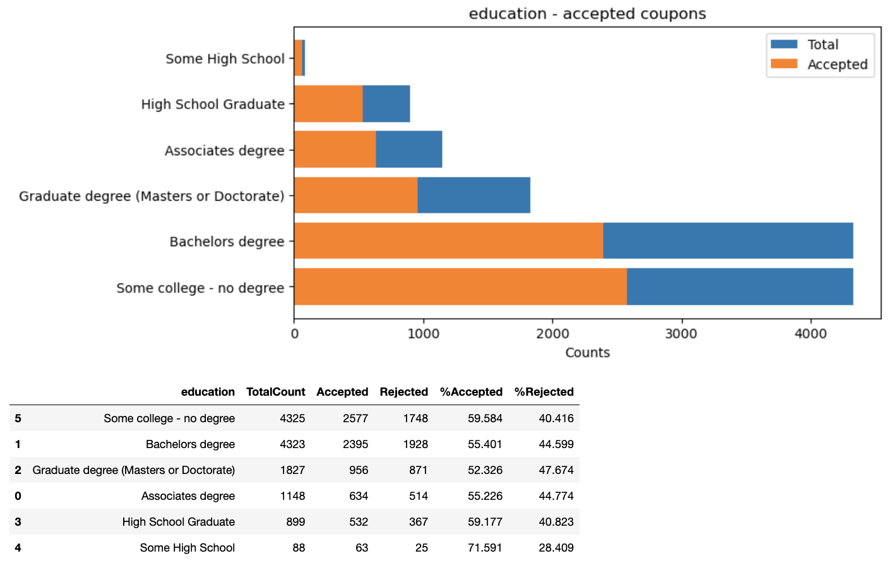

# Will a Customer Accept the Coupon?
<br> 

## Table of Contents: ##
- [Jupyter Notebook](https://github.com/RadxRk/Customer-Accept-Coupon/edit/main/README.md#Jupyter-Notebook)
- [Overview](https://github.com/RadxRk/Customer-Accept-Coupon/edit/main/README.md#Overview) 
- [Context](https://github.com/RadxRk/Customer-Accept-Coupon/edit/main/README.md#Context)
- [Dataset Information](https://github.com/RadxRk/Customer-Accept-Coupon/edit/main/README.md#Dataset-Information) 
- [User attributes](https://github.com/RadxRk/Customer-Accept-Coupon/edit/main/README.md#user-attributes) 
- [Loading Data](https://github.com/RadxRk/Customer-Accept-Coupon#missing-and-duplicated-data)
- [Investigate the dataset](https://github.com/RadxRk/Customer-Accept-Coupon#Investigate-the-dataset)
- [Data Transformation](https://github.com/RadxRk/Customer-Accept-Coupon#Data-Transformation)
- [Preliminary Analysis](https://github.com/RadxRk/Customer-Accept-Coupon#Preliminary-Analysis)
- [Independent Investigation](https://github.com/RadxRk/Customer-Accept-Coupon#Independent-Investigation)
- [Conclusion](https://github.com/RadxRk/Customer-Accept-Coupon#Conclusion)


<br> 

### <p style="font-weight:bold">Jupyter Notebook</p> ###
PLease see my Jupyter Notebook for the detailed work: [Radx_Customer_Accept_the_Coupon.ipynb](https://github.com/RadxRk/Customer-Accept-Coupon/blob/main/Radx_Customer_Accept_the_Coupon.ipynb)

### <p style="font-weight:bold">Overview</p> ###
The goal of this project is to use what you know about visualizations and probability distributions to distinguish between customers who accepted a driving coupon versus those that did not.
<br> 

### <p style="font-weight:bold">Context</p> ###
Imagine driving through town and a coupon is delivered to your cell phone for a restaraunt near where you are driving. 
- Would you accept that coupon and take a short detour to the restaraunt? 
- Would you accept the coupon but use it on a sunbsequent trip? 
- Would you ignore the coupon entirely? 
- What if the coupon was for a bar instead of a restaraunt? What about a coffee house? 
- Would you accept a bar coupon with a minor passenger in the car? 
- What about if it was just you and your partner in the car? 
- Would weather impact the rate of acceptance? What about the time of day?
- Obviously, proximity to the business is a factor on whether the coupon is delivered to the driver or not, but what are the factors that 
determine whether a driver accepts the coupon once it is delivered to them? How would you determine whether a driver is likely to accept a coupon?
<br> 

### <p style="font-weight:bold">Dataset Information</p> ###
This data comes to us from the UCI Machine Learning repository and was collected via a survey on Amazon Mechanical Turk. The survey describes different driving scenarios including the destination, current time, weather, passenger, etc., and then ask the person whether he will accept the coupon if he is the driver. Answers that the user will drive there ‘right away’ or ‘later before the coupon expires’ are labeled as ‘Y = 1’ and answers ‘no, I do not want the coupon’ are labeled as ‘Y = 0’. There are five different types of coupons -- less expensive restaurants (under $20), coffee houses, carry out & take away, bar, and more expensive restaurants ($20 - $50).
<br>

### <p style="font-weight:bold">User attributes</p> ###
  ##### The attributes of this data set include: #####
  
    -  destination --> ['No Urgent Place' 'Home' 'Work']
    -  passanger --> ['Alone' 'Friend(s)' 'Kid(s)' 'Partner']
    -  weather --> ['Sunny' 'Rainy' 'Snowy']
    -  temperature --> [55 80 30]
    -  time --> ['2PM' '10AM' '6PM' '7AM' '10PM']
    -  coupon --> ['Restaurant(<20)' 'Coffee House' 'Carry out & Take away' 'Bar' 'Restaurant(20-50)']
    -  expiration --> ['1d' '2h']
    -  gender --> ['Female' 'Male']
    -  age --> ['21' '46' '26' '31' '41' '50plus' '36' 'below21']
    -  maritalStatus --> ['Unmarried partner' 'Single' 'Married partner' 'Divorced' 'Widowed']
    -  has_children --> [1 0]
    -  education --> ['Some college - no degree' 'Bachelors degree' 'Associates degree'
    -   'High School Graduate' 'Graduate degree (Masters or Doctorate)'
    -   'Some High School']
    -  occupation --> ['Unemployed' 'Architecture & Engineering' 'Student'
                        'Education&Training&Library' 'Healthcare Support'
                        'Healthcare Practitioners & Technical' 'Sales & Related' 'Management'
                        'Arts Design Entertainment Sports & Media' 'Computer & Mathematical'
                        'Life Physical Social Science' 'Personal Care & Service'
                        'Community & Social Services' 'Office & Administrative Support'
                        'Construction & Extraction' 'Legal' 'Retired'
                        'Installation Maintenance & Repair' 'Transportation & Material Moving'
                        'Business & Financial' 'Protective Service'
                        'Food Preparation & Serving Related' 'Production Occupations'
                        'Building & Grounds Cleaning & Maintenance' 'Farming Fishing & Forestry']
    -  income --> ['$37500 - $49999' '$62500 - $74999' '$12500 - $24999' '$75000 - $87499' '$50000 - $62499' '$25000 - $37499' '$100000 or More' '$87500                   - $99999' 'Less than $12500']
    -  car --> [nan 'Scooter and motorcycle' 'crossover' 'Mazda5' 'do not drive' 'Car that is too old to install Onstar :D']
    -  Bar --> ['never' 'less1' '1~3' 'gt8' nan '4~8']
    -  CoffeeHouse --> ['never' 'less1' '4~8' '1~3' 'gt8' nan]
    -  CarryAway --> [nan '4~8' '1~3' 'gt8' 'less1' 'never']
    -  RestaurantLessThan20 --> ['4~8' '1~3' 'less1' 'gt8' nan 'never']
    -  Restaurant20To50 --> ['1~3' 'less1' 'never' 'gt8' '4~8' nan]
    -  toCoupon_GEQ5min --> [1]
    -  toCoupon_GEQ15min --> [0 1]
    -  toCoupon_GEQ25min --> [0 1]
    -  direction_same --> [0 1]
    -  direction_opp --> [1 0]
    -  Y --> [1 0]

### <p style="font-weight:bold">Loading Data</p> ###
Dataset is loaded into the coupons coupons_data dataframe for futher analysis and cleanup
```python
import matplotlib.pyplot as plt
import seaborn as sns
import pandas as pd
import numpy as np

coupons_data = pd.read_csv('data/coupons.csv')
``` 
### <p style="font-weight:bold">Investigate the dataset</p> ###
Investigate the dataset for missing or problematic data. 
##### Decide what to do about your missing data -- drop, replace, other.

```python
#Finding missing/Null/NaN values
coupons_data.isnull().sum()/coupons_data.shape[0]*100 
```
<pre><code>destination              0.000000
passanger                0.000000
weather                  0.000000
temperature              0.000000
time                     0.000000
coupon                   0.000000
expiration               0.000000
gender                   0.000000
age                      0.000000
maritalStatus            0.000000
has_children             0.000000
education                0.000000
occupation               0.000000
income                   0.000000
car                     99.148534
Bar                      0.843582
CoffeeHouse              1.710817
CarryAway                1.190476
RestaurantLessThan20     1.024913
Restaurant20To50         1.490066
toCoupon_GEQ5min         0.000000
toCoupon_GEQ15min        0.000000
toCoupon_GEQ25min        0.000000
direction_same           0.000000
direction_opp            0.000000
Y                        0.000000</code></pre>
Car attribute is missing 99% of data and needs to be removed.
Bar,CoffeeHouse,CarryAway,RestaurantLessThan20,Restaurant20To50 columns have 1% of null records and needs to replaced with 'Nothing'

```python
# Droping the car column
coupons_data=coupons_data.drop('car',axis=1)
coupons_data.columns

#Remove the duplicates
coupons_data=coupons_data.drop_duplicates()
# Fill NaN/Null with Nothing for the columns "CarryAway","CoffeeHouse","RestaurantLessThan20","Restaurant20To50","Bar"
coupons_data["CarryAway"].fillna("Nothing", inplace=True)
coupons_data["CoffeeHouse"].fillna("Nothing", inplace=True)
coupons_data["RestaurantLessThan20"].fillna("Nothing", inplace=True)
coupons_data["Restaurant20To50"].fillna("Nothing", inplace=True)
coupons_data["Bar"].fillna("Nothing", inplace=True)
# Check if the NaN/Null are removed
coupons_data.isnull().sum()/coupons_data.shape[0]*100 
```
### <p style="font-weight:bold">Data Transformation</p> ###
Following attributes are cleaned up for futher analysis
- temperature
- CarryAway
- RestaurantLessThan20 
- Restaurant20To50
- toCoupon_GEQ5min,toCoupon_GEQ15min,toCoupon_GEQ25min to drive_to_coupon column
```python
# Sample code to demonstrate the transformation
RestaurantLessThan20_mapping = {
    'less1': 1,
    '1~3':2,
    '4~8':6, 
    'gt8':9,
    'never':0,
    'Nothing':0
};
coupons_data['Restaurant20To50'] = coupons_data['Restaurant20To50'].map(RestaurantLessThan20_mapping);

def column_to_coupon(col):
    toCoupon_GEQ5min,toCoupon_GEQ15min,toCoupon_GEQ25min = list(map(str,col))
    if toCoupon_GEQ5min == '1':
        if toCoupon_GEQ15min=='1':
            if toCoupon_GEQ25min=='1':
                return 'within 25mins'
            else:
                return 'within 15mins'
        else:
            return 'within 5mins'
coupons_data['drive_to_coupon'] = coupons_data[['toCoupon_GEQ5min','toCoupon_GEQ15min','toCoupon_GEQ25min']].apply(column_to_coupon,axis=1,raw=True)
coupons_data=coupons_data.drop(['toCoupon_GEQ5min','toCoupon_GEQ15min','toCoupon_GEQ25min'],axis=1)
``` 

### <p style="font-weight:bold">Preliminary Analysis</p> ###

- #### What proportion of the total observations chose to accept the coupon?
  <div style="text-align:center">
    
  </div>
  <li> The overall accepectance rate for this dataset is high compared to the total number of rows
       Accepted percentage 56.75%
       Not Accepted 43.24%
   </li>
 - #### Use a bar plot to visualize the coupon column
  <div style="text-align:center">
    
  </div>
    <li>  From the graph above there is a high representation of coupon for coffee house.Restaurant(20-50) arrtibute has the least of the coupons. Data indicates that expensive restaurants doesn't give out coupons in this dataset.  </li>
    
 - #### Use a bar plot to visualize the coupon column based on the target variable acceptance or non acceptance
   <div style="text-align:center">
    
  </div>
<li> From the graph above we could drive that there is high non acceptance of coupons in the bar and higher price restaturants(Restaurant(20-50)). On the other hand there is high acceptance among Restaurant(<20) </li>


 - #### Compare the acceptance rates between those drivers who:
       go to bars more than once a month, had passengers that were not a kid, and were not widowed OR
       go to bars more than once a month and are under the age of 30 OR
       go to cheap restaurants more than 4 times a month and income is less than 50K.
 <div style="text-align:center">
    
  </div>
  <li> Bar coupon is not the popular as other coupons. It has only 41% accepetance rate  </li>
  <li> Acceptance rate of those who went more than 3 times a month is 7% </li>
 

### <p style="font-weight:bold">Independent Analysis</p> ###  
 - #### Do people with more income prefer expensive restraunts(Restaurant20To50) with bar coupon?
  <div style="text-align:center">
    
  </div>
  <li>  Regardless of income group, everyone visited expensive restaurants( Restaurant20To50) at least once. </li>
  <li>  People with incomerange 37K-49K visited expensive restaurants( Restaurant20To50) with bar coupons </li>
  
  Education_Analysis.png
 - #### Does education attribute have any impact on the coupon accepectance??   
   <div style="text-align:center">
    
  </div>
  <li>  We have high number of Bachelors and no degree in the source data, which can cause imbalance in the model </li>
  <li>  Users with no college & highschool have coupons acceptance rate </li>
  
### <p style="font-weight:bold">Conclusion</p> ###

<li>  Dataset is not large enough to do any deeper analysis. The total count is  12610 after the duplicates are removed </li>
<li>  Dataset is has high acceptance rate and can also cause imbalance in the analysis </li>
<li>  Coffee House and Restaurant less than 20$ have acceptance and the coupons are working well for that group </li>
<li>  Bar's and Restaurant above 50$ have least acceptance </li>
<li>  Coupons are most acceptanced when users are trave not urgent places</li>
<li>  There are high acceptance among college and no college users </li>
  

 
